#### 탐색적 분석, Bee swarm plot, 이항 분포, 지수 분포

----------------------------------


```python
import numpy as np
import pandas as pd
```


```python
import seaborn as sb
```


```python
# Set default Seaborn style
sb.set()
```


```python
import matplotlib.pyplot as plt
%matplotlib inline
```


```python
# setting plot defatult size
%pylab inline
pylab.rcParams['figure.figsize'] = (12, 6)
```

    Populating the interactive namespace from numpy and matplotlib


## 1. Graphical exploratory data analysis


```python
from sklearn.datasets import load_iris
iris = load_iris()
iris.feature_names
```


    ['sepal length (cm)',
     'sepal width (cm)',
     'petal length (cm)',
     'petal width (cm)']


```python
iris.target_names
```


    array(['setosa', 'versicolor', 'virginica'], 
          dtype='<U10')


```python
virginica_petal_length = iris.data[100:150,2]
virginica_petal_length
```


    array([ 6. ,  5.1,  5.9,  5.6,  5.8,  6.6,  4.5,  6.3,  5.8,  6.1,  5.1,
            5.3,  5.5,  5. ,  5.1,  5.3,  5.5,  6.7,  6.9,  5. ,  5.7,  4.9,
            6.7,  4.9,  5.7,  6. ,  4.8,  4.9,  5.6,  5.8,  6.1,  6.4,  5.6,
            5.1,  5.6,  6.1,  5.6,  5.5,  4.8,  5.4,  5.6,  5.1,  5.1,  5.9,
            5.7,  5.2,  5. ,  5.2,  5.4,  5.1])


### Histogram


```python
plt.hist(virginica_petal_length)
plt.ylabel('count')
plt.xlabel('petal length (cm)')
plt.title('virginica_petal_length')
plt.show()
```


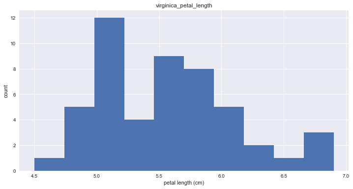


```python
# Adjusting the number of bins
```


```python
n_data = len(virginica_petal_length)
n_bins = int(np.sqrt(n_data))
n_bins
```


    7


```python
plt.hist(virginica_petal_length, bins=n_bins, edgecolor='black', facecolor='orange')
plt.ylabel('count')
plt.xlabel('petal length (cm)')
plt.title('virginica_petal_length')
```


    <matplotlib.text.Text at 0x10f778f28>


### Transform iris dataset to pandas DataFrame


```python
df_iris = pd.DataFrame(data = np.c_[iris['data'], iris['target']],
                       columns = iris['feature_names'] + ['target'])
df_iris.head()
```


<div>
<table border="1" class="dataframe">
  <thead>
    <tr style="text-align: right;">
      <th></th>
      <th>sepal length (cm)</th>
      <th>sepal width (cm)</th>
      <th>petal length (cm)</th>
      <th>petal width (cm)</th>
      <th>target</th>
    </tr>
  </thead>
  <tbody>
    <tr>
      <th>0</th>
      <td>5.1</td>
      <td>3.5</td>
      <td>1.4</td>
      <td>0.2</td>
      <td>0.0</td>
    </tr>
    <tr>
      <th>1</th>
      <td>4.9</td>
      <td>3.0</td>
      <td>1.4</td>
      <td>0.2</td>
      <td>0.0</td>
    </tr>
    <tr>
      <th>2</th>
      <td>4.7</td>
      <td>3.2</td>
      <td>1.3</td>
      <td>0.2</td>
      <td>0.0</td>
    </tr>
    <tr>
      <th>3</th>
      <td>4.6</td>
      <td>3.1</td>
      <td>1.5</td>
      <td>0.2</td>
      <td>0.0</td>
    </tr>
    <tr>
      <th>4</th>
      <td>5.0</td>
      <td>3.6</td>
      <td>1.4</td>
      <td>0.2</td>
      <td>0.0</td>
    </tr>
  </tbody>
</table>
</div>


```python
# 0:setosa, 1:versicolor, 2:virginica
df_iris.columns = ['sepal_length','sepal_width','petal_length','petal_width','target']
df_iris['target'] = df_iris['target'].astype('int')
df_iris.head()
```


<div>
<table border="1" class="dataframe">
  <thead>
    <tr style="text-align: right;">
      <th></th>
      <th>sepal_length</th>
      <th>sepal_width</th>
      <th>petal_length</th>
      <th>petal_width</th>
      <th>target</th>
    </tr>
  </thead>
  <tbody>
    <tr>
      <th>0</th>
      <td>5.1</td>
      <td>3.5</td>
      <td>1.4</td>
      <td>0.2</td>
      <td>0</td>
    </tr>
    <tr>
      <th>1</th>
      <td>4.9</td>
      <td>3.0</td>
      <td>1.4</td>
      <td>0.2</td>
      <td>0</td>
    </tr>
    <tr>
      <th>2</th>
      <td>4.7</td>
      <td>3.2</td>
      <td>1.3</td>
      <td>0.2</td>
      <td>0</td>
    </tr>
    <tr>
      <th>3</th>
      <td>4.6</td>
      <td>3.1</td>
      <td>1.5</td>
      <td>0.2</td>
      <td>0</td>
    </tr>
    <tr>
      <th>4</th>
      <td>5.0</td>
      <td>3.6</td>
      <td>1.4</td>
      <td>0.2</td>
      <td>0</td>
    </tr>
  </tbody>
</table>
</div>


```python
def make_species(x):
    l_species = []
    for i in x:
        if (i == 0):
            l_species.append('setosa')
        elif (i == 1):
            l_species.append('versicolor')
        else:
            l_species.append('virginica')
            
    return l_species
```


```python
df_iris['species'] = make_species(np.array(df_iris['target']))
df_iris.head()
```


<div>
<table border="1" class="dataframe">
  <thead>
    <tr style="text-align: right;">
      <th></th>
      <th>sepal_length</th>
      <th>sepal_width</th>
      <th>petal_length</th>
      <th>petal_width</th>
      <th>target</th>
      <th>species</th>
    </tr>
  </thead>
  <tbody>
    <tr>
      <th>0</th>
      <td>5.1</td>
      <td>3.5</td>
      <td>1.4</td>
      <td>0.2</td>
      <td>0</td>
      <td>setosa</td>
    </tr>
    <tr>
      <th>1</th>
      <td>4.9</td>
      <td>3.0</td>
      <td>1.4</td>
      <td>0.2</td>
      <td>0</td>
      <td>setosa</td>
    </tr>
    <tr>
      <th>2</th>
      <td>4.7</td>
      <td>3.2</td>
      <td>1.3</td>
      <td>0.2</td>
      <td>0</td>
      <td>setosa</td>
    </tr>
    <tr>
      <th>3</th>
      <td>4.6</td>
      <td>3.1</td>
      <td>1.5</td>
      <td>0.2</td>
      <td>0</td>
      <td>setosa</td>
    </tr>
    <tr>
      <th>4</th>
      <td>5.0</td>
      <td>3.6</td>
      <td>1.4</td>
      <td>0.2</td>
      <td>0</td>
      <td>setosa</td>
    </tr>
  </tbody>
</table>
</div>


## Bee swarm plots


```python
_ = sb.swarmplot(x='species', y='petal_length', data=df_iris)
_ = plt.xlabel('species')
_ = plt.ylabel('petal length (cm)')
plt.show()
```


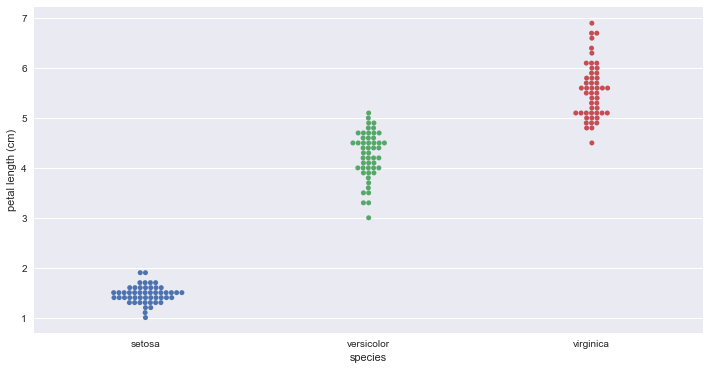


```python
# 2012년 미국 대선 데이터
```


```python
df = pd.read_csv('data/election2012.csv')
states = (df['state'] == 'CA') | (df['state'] == 'NY') | (df['state'] == 'OH') | (df['state'] == 'TX')
df2012 = df.loc[states]
df2012.head()
```


<div>
<table border="1" class="dataframe">
  <thead>
    <tr style="text-align: right;">
      <th></th>
      <th>state</th>
      <th>county</th>
      <th>Obama</th>
      <th>Romney</th>
      <th>winner</th>
      <th>total</th>
      <th>margin</th>
      <th>turnout</th>
    </tr>
  </thead>
  <tbody>
    <tr>
      <th>157</th>
      <td>CA</td>
      <td>Alameda</td>
      <td>78.5</td>
      <td>18.7</td>
      <td>Obama</td>
      <td>542421</td>
      <td>59.8</td>
      <td>2.8</td>
    </tr>
    <tr>
      <th>158</th>
      <td>CA</td>
      <td>Alpine</td>
      <td>60.1</td>
      <td>36.5</td>
      <td>Obama</td>
      <td>625</td>
      <td>23.6</td>
      <td>3.4</td>
    </tr>
    <tr>
      <th>159</th>
      <td>CA</td>
      <td>Amador</td>
      <td>39.2</td>
      <td>58.2</td>
      <td>Romney</td>
      <td>14904</td>
      <td>19.0</td>
      <td>2.6</td>
    </tr>
    <tr>
      <th>160</th>
      <td>CA</td>
      <td>Butte</td>
      <td>46.4</td>
      <td>50.3</td>
      <td>Romney</td>
      <td>67879</td>
      <td>3.9</td>
      <td>3.3</td>
    </tr>
    <tr>
      <th>161</th>
      <td>CA</td>
      <td>Calaveras</td>
      <td>40.1</td>
      <td>57.1</td>
      <td>Romney</td>
      <td>17941</td>
      <td>17.0</td>
      <td>2.8</td>
    </tr>
  </tbody>
</table>
</div>


```python
_ = sb.swarmplot(x='state', y='Obama', data=df2012)
_ = plt.xlabel('state')
_ = plt.ylabel('vote Obama %')
_ = plt.title('distribution of counties')
plt.show()
```


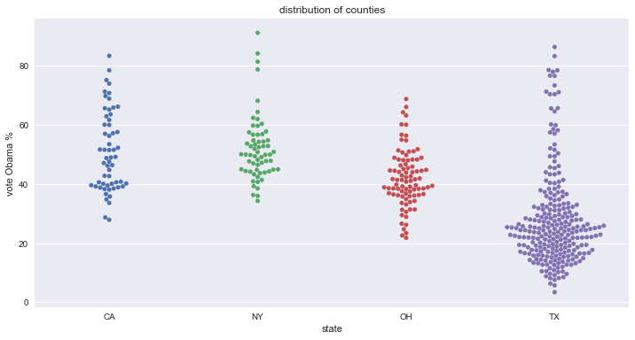


## Empirical cumulative distribution function (ECDF)


```python
def ecdf(data):
    """Compute ECDF for a one-dimensional array of measurements."""
    n = len(data)      # Number of data points
    x = np.sort(data)
    y = np.arange(1, n+1) / n

    return x, y
```


```python
# Compute ECDF for versicolor data
x_value, y_value = ecdf(virginica_petal_length)

# Generate plot
_ = plt.plot(x_value, y_value, marker='.', linestyle='none')
_ = plt.margins(0.02)
_ = plt.ylabel('ECDF')
_ = plt.xlabel('virginica petal length')
plt.show()

# 4.5 ~ 5.5cm : 전체의 50%
# 6.0cm 이상 : 전체의 20%
```


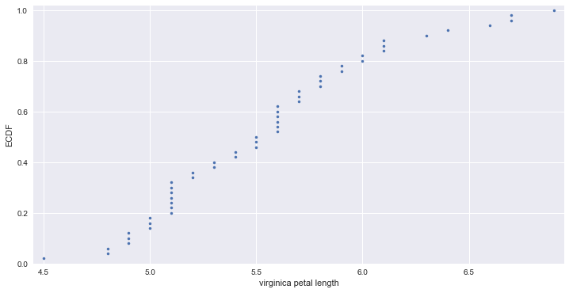


```python
# Comparison of ECDFs
```


```python
setosa_petal_length = iris.data[0:50,2]
versicolor_petal_length = iris.data[50:100,2]
virginica_petal_length = iris.data[100:150,2]
```


```python
# Compute ECDFs
x_set, y_set = ecdf(setosa_petal_length)
x_vers, y_vers = ecdf(versicolor_petal_length)
x_virg, y_virg = ecdf(virginica_petal_length)

# Plot all ECDFs on the same plot
_ = plt.plot(x_set, y_set, marker='.', linestyle='none')
_ = plt.plot(x_vers, y_vers, marker='.', linestyle='none')
_ = plt.plot(x_virg, y_virg, marker='.', linestyle='none')

plt.margins(0.02)

# Annotate the plot
_ = plt.legend(('setosa', 'versicolor', 'virginica'), loc='lower right')
_ = plt.xlabel('petal length (cm)')
_ = plt.ylabel('ECDF')

plt.show()
```


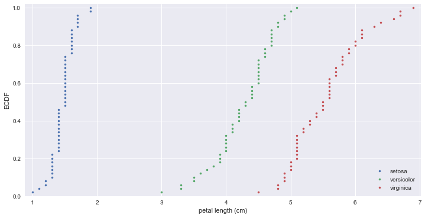


```python
# 2012 미국 대선
```


```python
vote_ny = df2012[df2012['state'] == 'NY']['Obama']
vote_oh = df2012[df2012['state'] == 'OH']['Obama']
vote_tx = df2012[df2012['state'] == 'TX']['Obama']
```


```python
# Compute ECDFs
x_set, y_set = ecdf(vote_ny)
x_vers, y_vers = ecdf(vote_oh)
x_virg, y_virg = ecdf(vote_tx)

# Plot all ECDFs on the same plot
_ = plt.plot(x_set, y_set, marker='.', linestyle='none')
_ = plt.plot(x_vers, y_vers, marker='.', linestyle='none')
_ = plt.plot(x_virg, y_virg, marker='.', linestyle='none')

plt.margins(0.02)

# Annotate the plot
_ = plt.legend(('NY', 'OH', 'TX'), loc='lower right')
_ = plt.xlabel('vote Obama')
_ = plt.ylabel('ECDF')

plt.show()
```


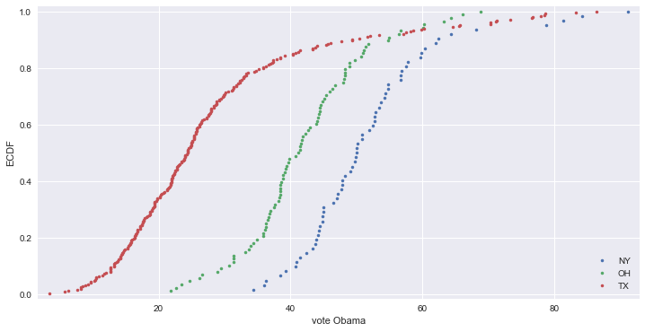


## 2. Quantitative exploratory data analysis


```python
np.mean(vote_ny)
```


    51.967741935483886


```python
np.median(vote_ny)
```


    50.0


### Box plot


```python
sb.boxplot(x='species', y='petal_length', data=df_iris)
_ = plt.xlabel('species')
_ = plt.ylabel('petal length (cm)')
plt.show()
```


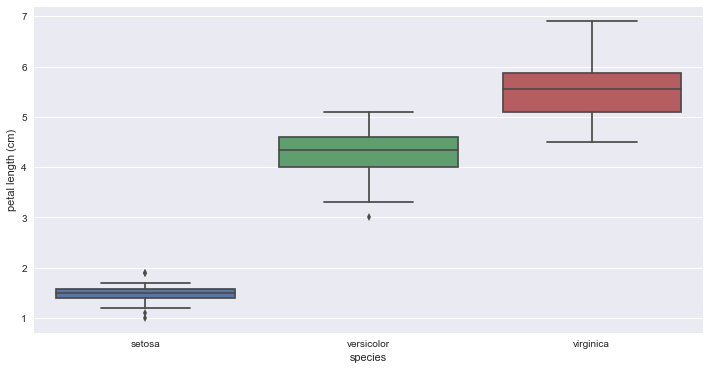


```python
sb.boxplot(x='state', y='Obama', data=df2012)
_ = plt.xlabel('state')
_ = plt.ylabel('vote Obama %')
plt.show()
```


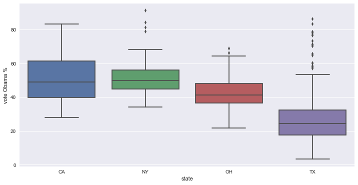


```python
# 미투표자 비율에 대한 오바마 지지율
_ = plt.plot(df2012.turnout, df2012.Obama, marker='.', linestyle='none')
_ = plt.xlabel('% of not vote')
_ = plt.ylabel('percent of vote for Obama')
```


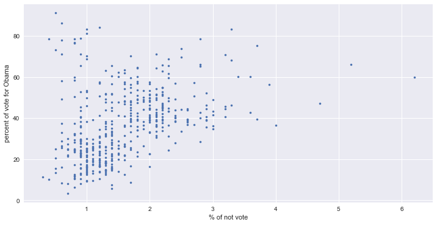


```python
np.cov(df2012.turnout, df2012.Obama)
```


    array([[   0.56269093,    4.97298927],
           [   4.97298927,  299.29556718]])


```python
def pearson_r(x, y):
    """Compute Pearson correlation coefficient between two arrays."""
    corr_mat = np.corrcoef(x, y)
    return corr_mat[0,1]
```


```python
pearson_r(df2012.turnout, df2012.Obama)
```


    0.38320610690704882


## 3. Probability - Discrete variables

### Bernoulli trials - 1 or 0 (성공 / 실패)


```python
def perform_bernoulli_trials(n, p):
    """Perform n Bernoulli trials with success probability p and return number of successes."""
    
    n_success = 0

    for i in range(n):
        # Choose random number between 0 and 1
        random_number = np.random.random()

        # If less than p, it's a success  so add one to n_success
        if random_number < p:
            n_success += 1

    return n_success
```


```python
# 100 명의 대출자 파산 확률 0.05. 1000 번 시뮬레이션
n_defaults = np.empty(1000)

for i in range(1000):
    n_defaults[i] = perform_bernoulli_trials(100, 0.05)

_ = plt.hist(n_defaults, normed=True, edgecolor='black')
_ = plt.xlabel('number of defaults out of 100 loans')
_ = plt.ylabel('probability')
plt.show()
```


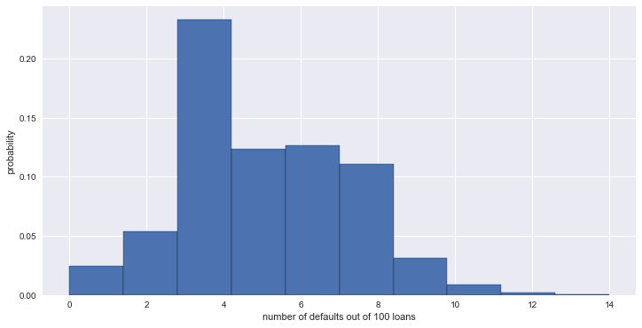


```python
# 위 상황에 대한 ECDF
x, y = ecdf(n_defaults)

_ = plt.plot(x, y, marker='.', linestyle='none')
_ = plt.xlabel('number of defaults out of 100')
_ = plt.ylabel('CDF')
plt.show()

# 파산자가 10명 이상이 될 경우의 수 합계
n_lose_money = np.sum(n_defaults >= 10)
print('Probability of losing money =', n_lose_money / len(n_defaults))
```


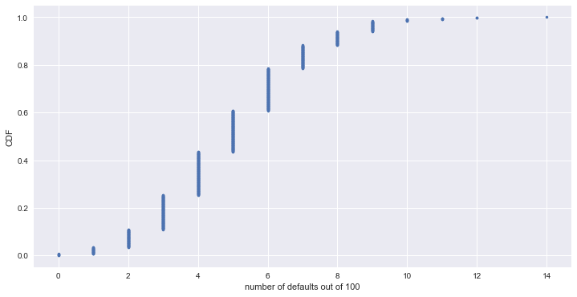


    Probability of losing money = 0.016


### Binomial distribution (이항 분포)


```python
n_defaults = np.random.binomial(n=100, p=0.05, size=10000)

# CDF
x, y = ecdf(n_defaults)

_ = plt.plot(x, y, marker='.', linestyle='none')
_ = plt.xlabel('number of defaults out of 100 loans')
_ = plt.ylabel('CDF')
plt.show()
```


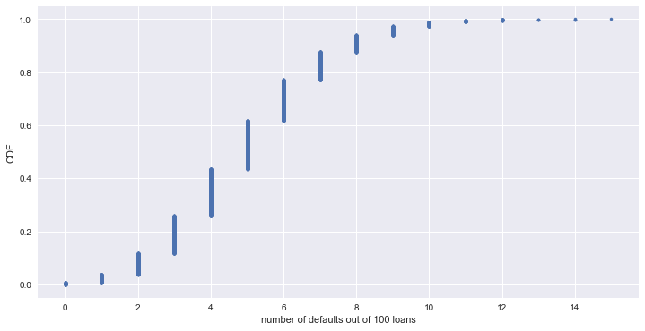


### Probability mass function (PMF) - The set of probabilities of discrete outcomes


```python
bins = np.arange(0, max(n_defaults) + 1.5) - 0.5

_ = plt.hist(n_defaults, normed=True, bins=bins, edgecolor='white')
_ = plt.xlabel('number of defaults out of 100 loans')
_ = plt.ylabel('PMF')
plt.margins(0.02)
plt.show()
```


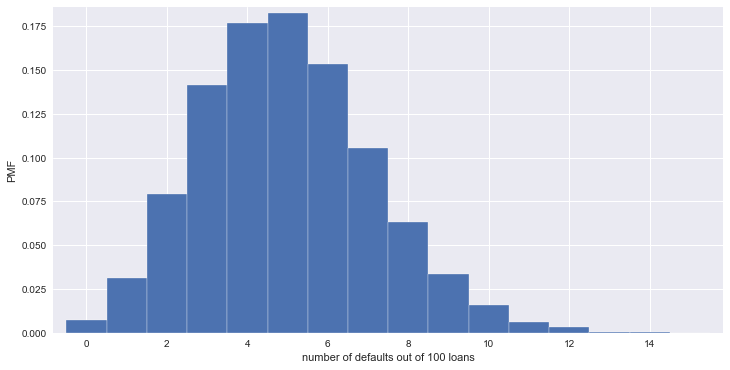


## 4. Probability - Continuous variables


```python
# 1926년부터 경마 최고 기록
horse_race = np.array([ 148.51, 146.65, 148.52, 150.7, 150.42, 150.88, 151.57, 147.54, 149.65, 148.74, 147.86, 148.75, 147.5, 148.26, 149.71, 146.56, 151.19, 147.88, 149.16, 148.82, 148.96, 152.02, 146.82, 149.97, 146.13, 148.1, 147.2, 146., 149.8, 147., 147.2, 147.8, 148.2, 149., 149.8, 148.6, 146.8, 149.6, 149., 148.2, 149.2, 148., 150.4, 148.8, 147.2, 148.8, 149.6, 148.4, 148.4, 150.2, 148.8, 149.2, 149.2, 148.4, 150.2, 146.6, 149.8, 149., 150.8, 148.6, 150.2, 149., 148.6, 150.2, 148.2, 149.4, 150.8, 150.2, 152.2, 148.2, 149.2, 151., 149.6, 149.6, 149.4, 148.6, 150., 150.6, 149.2, 152.6, 152.8, 149.6, 151.6, 152.8, 153.2, 152.4, 152.2 ])
```


```python
# 평균과 표준편차
mu = np.mean(horse_race)
sigma = np.std(horse_race)
horse_race
# 샘플링
samples = np.random.normal(mu, sigma, size=10000)

# 샘플링 데이터와 실제 데이터의 CDF
x_theor, y_theor = ecdf(samples)
x, y = ecdf(horse_race)

_ = plt.plot(x_theor, y_theor)
_ = plt.plot(x, y, marker='.', linestyle='none')
_ = plt.xlabel('Belmont winning time (sec.)')
_ = plt.ylabel('CDF')
plt.margins(0.02) 
plt.show()
```


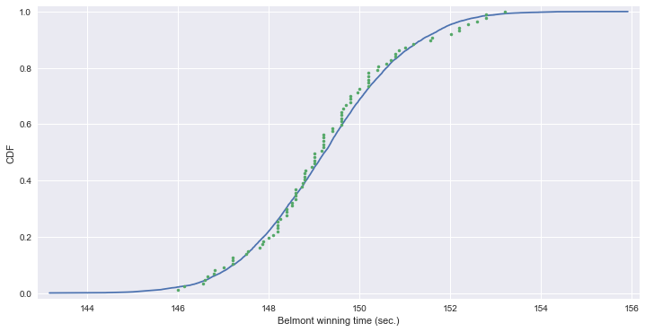


```python
np.min(horse_race)
```


    146.0


```python
# 위 기록을 깰 확률을 시뮬레이션
```


```python
samples = np.random.normal(mu, sigma, size=100000)
prob = np.sum(samples <= 146) / len(samples)

print('위 기록을 깰 확률:', prob)
```

    위 기록을 깰 확률: 0.02097


### Exponential distribution


```python
# 미국 메이저리그 야구
# no-hitter : 투수가 한 경기에서 한번도 안타를 내주지 않음. 평균 764 경기 당 1회 발생.
# cycling hit : 타자가 한 경기에서 1루타, 2루타, 3루타, 홈런을 모두 기록. 평균 715 경기 당 1회 발생.
```


```python
def successive_poisson(tau1, tau2, size=1):
    # Draw samples out of first exponential distribution
    t1 = np.random.exponential(tau1, size=size)

    # Draw samples out of second exponential distribution
    t2 = np.random.exponential(tau2, size=size)

    return t1 + t2
```


```python
# no-hitter와 cycling hit가 같이 나타나기 까지의 waiting game 수 시뮬레이션
waiting_times = successive_poisson(764, 715, size=100000)
waiting_times
```


    array([ 1519.61768867,  2444.63870183,   913.80439492, ...,   726.54811866,
            1397.66102354,  1111.50886872])


```python
_ = plt.hist(waiting_times, bins=100, histtype='step', normed=True, edgecolor='blue')
_ = plt.xlabel('total waiting time (games)')
_ = plt.ylabel('PDF')
plt.show()
```


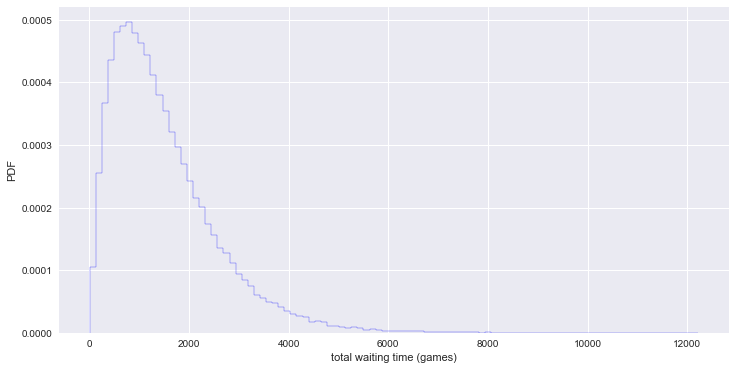

