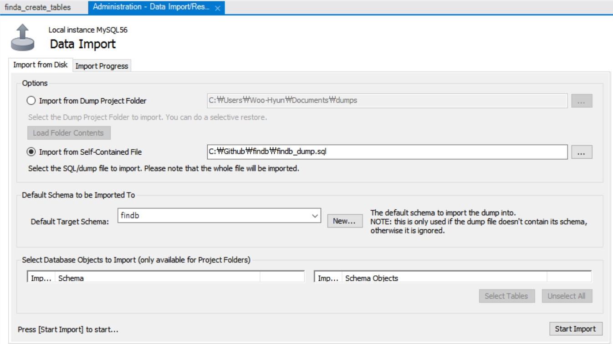
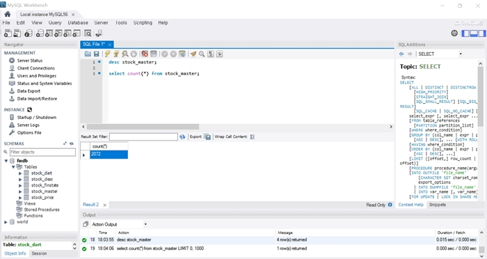
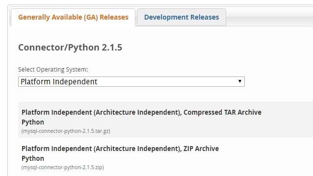

#### [FinDA] Windows에 데이터 수집 및 분석 환경 만들기


----------------------------------

# 1. Python

* 파이썬은 3.5 이상 64 비트 버전으로 설치할 것
* Tensorflow 는 64 비트만 지원됨

### 필요한 python package 설치 (콘솔)

```bash
# pip 업그레이드
> pip3 install -U pip
> pip3 install -U setuptools

# virtualenv 설치
> pip3 install virtualenv

# numpy, pandas 설치
> pip3 install numpy
> pip3 install cython
> pip3 install pandas
> pip3 install pandas_datareader

# ipython, jupyter, matplotlib
> pip3 install pyzmq tornado matplotlib jinja2 pygments
> pip3 install jupyter

# requests, beautifulsoup4
> pip3 install requests
> pip3 install lxml
> pip3 install beautifulsoup4
> pip3 install xlrd
```

# 2. MySQL

## MySQL 설치

[MySQL Community Server 5.6.13.1](https://dev.mysql.com/downloads/file/?id=414335) 다운로드

설치 중 root 및 admin 사용자 계정 생성 및 암호 설정

* root   / finda\***
* woosa7 / finda\***  (DB Admin User)

설치 완료 후 MySQL \ MySQLServer 폴더의 my.ini 파일 열어서 다음 설정 확인 및 수정. (인코딩 : utf-8)

* default-character-set=utf8 
* character-set-server=utf8

## 시스템 환경 변수에 MySQL 실행파일 경로 추가

* 윈도 아이콘 - 마우스 오른쪽 버튼 - 시스템 - 고급 시스템 설정 - 환경변수

* 시스템 변수 PATH 에 "c:\MySQL\MySQL Server 5.6\bin" 경로 추가

## MySQL 설치 확인

콘솔에서 mysql 접속

```bash
> mysql -uroot -p
(root 계정 암호 입력)
```

```bash
mysql> use world;                    # (default DB)
mysql> select count(*) from city;    # 4079
mysql> exit
```

# 3. 데이터 수집 및 분석을 위한 DB 생성

* MySQL Workbench 실행
* Create a new schema 아이콘 클릭


* Collation을 "utf8 - default collation"으로 선택 후 schema 생성

### 생성해 놓은 기초 데이터 복원

* dropbox 에서 findb_dump.sql.gz 다운로드 후 압축 해제. [링크](https://www.dropbox.com/s/1f44sylm9b32jqi/findb_dump.sql.gz?dl=0)

* (참고) 테이블 생성을 위한 스크립트 [링크](https://www.dropbox.com/s/wfxiscrkb0d9xez/finda_create_tables.sql?dl=0)

* Navigator 메뉴 중 Data Import/Restore 선택



* Import form self-Contained File 선택 (schema 레벨로 복원)

* Default Target Schema 목록에서 해당 스키마 선택

* Start Import 버튼 클릭

복원 완료 후 데이터 확인 (MySQL Workbench)

```bash
desc stock_master;
select count(*) from stock_master;
```



# 4. python을 위한 mysql-connector 설치

https://dev.mysql.com/downloads/connector/python/

Python 3.5 이상일 경우 Select Operating System에서 "Platfor Independent" 선택



zip 파일 다운로드 후 압축 해제

콘솔창에서 해당 폴더로 이동한 후 다음 명령 입력

``` bash
> python setup.py install
```

설치 확인

``` bash
> python

>>> import mysql.connector

에러 없으면 정상적으로 설치된 것.

```
